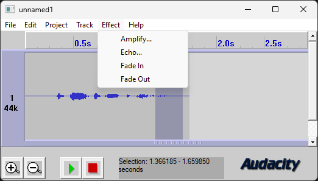

On this day, 25 years ago, the very first public version of Audacity was released, Audacity 0.8. 

Audacity 0.8 was very different to what we have today: It couldn't record, it couldn't use plugins, and it could only export as WAV, AIFF, [SF](https://www.mmsp.ece.mcgill.ca/Documents/AudioFormats/IRCAM/IRCAM.html) and [AU](https://en.wikipedia.org/wiki/Au_file_format).

Since then, a lot has happened. Audacity 1.0 was released two years later, sporting a logo and layout that's still recognizable today. PCs have turned notably less boxy and beige, and are much faster as well. They're so fast in fact, that many features which would have been unthinkable 25 years ago are now very much possible - and even expected. We have worked tirelessly to improve Audacity's audio editing capabilities, adding features like [realtime effects](https://www.youtube.com/watch?v=DTRnDNR9LR8), [non-destructive edits](https://www.youtube.com/watch?v=HpA138b-J9s) and [time stretching](https://www.youtube.com/watch?v=xgdYuSHdkso), a [master channel](https://www.youtube.com/watch?v=f5TXPUOFH6A) and even some [AI-powered effects which are actually useful](/download/openvino). 

If you're curious to learn more about Audacity's history, our product owner [Martin Keary released a video about it](https://www.youtube.com/watch?v=RMWNvwLiXIQ) when he took over, and our designer [Leo Wattenberg ran Audacity's source code through a visualizer](https://www.youtube.com/watch?v=WuG-Aw2Nv1k) to show the evolution of files within Audacity. 

## What's next for Audacity 

We're planning to release another minor patch (Audacity 3.7.4) in the next couple weeks, which among various bug fixes finally brings aforementioned AI effects to macOS. 

In addition to that, we're still working hard on Audacity 4.0, which won't be quite yet a DAW – but will tackle a lot of UX snags, which made Audacity so far more annoying to use than necessary. We will soon post an update on what to expect exactly for Audacity 4.0. 

## Let's celebrate with Audacity merch!

After 25 years of making it rather difficult to send any money our way, we finally have opened up a merch store at [**merch.audacityteam.org**](https://merch.audacityteam.org). Every purchase made will help support our full-size development team, and accelerate Audacity's progress to becoming not just the free option for audio editing - but the best option. 

We'll add more designs over the coming months - follow us on [YouTube](https://www.youtube.com/@audacity) or join our [Discord](https://discord.com/audacity) to get notified when new merch drops!

