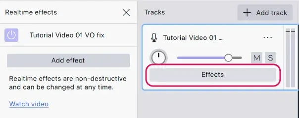
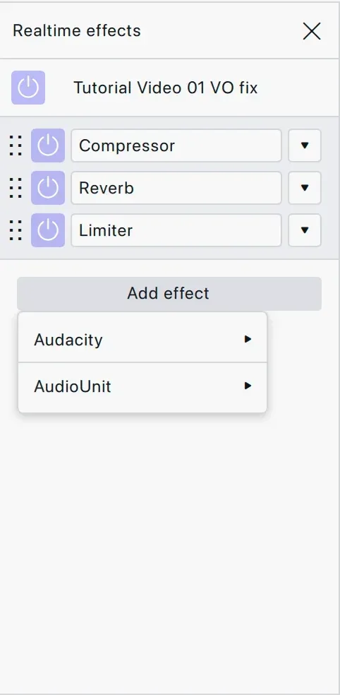

import Callout from "../../../components/manual/Callout.astro";
import Shortcut from "../../../components/manual/Shortcut.jsx";

Before you apply anything, it helps to know that Audacity can apply an effect
in two different ways, and the difference matters once you want to change your
mind.

## Two ways to apply an effect

| | How it works |
| --- | --- |
| **Destructive** | Applied from the **Effect** menu to a selection. Audacity rewrites the audio itself, and you can see the waveform change. Undo will step back out of it while the project is open, but once you close the project the change is part of your audio for good. |
| **Non-destructive** | Added as a **realtime effect** on a track, or drawn as clip gain. Your recording is left alone and the effect is calculated on playback, so you can adjust it, switch it off, or remove it at any point, even weeks later. |

## The Effect menu

Every destructive effect lives in the **Effect** menu, grouped by what it
does. Select the audio first, then pick an effect: it acts on the selection
only, and the waveform redraws when it finishes.

## Realtime effects

The **Effects** button on the track header opens the realtime effects panel
for that track. The keyboard shortcut is <Shortcut client:load keys="e" />.

Add effects to the stack and they run in the order they are listed, top to
bottom. Notice that the waveform does not change: nothing has been written
into your audio. Each effect can be switched off with its own button, reopened
and tweaked while the track is playing, or dragged out of the stack entirely,
and the recording underneath is untouched throughout.

<Callout type="tip" title="Start with realtime effects">
  Realtime effects are the easier place to experiment, since you can hear a
  change and undo your thinking without touching the recording. Use the Effect
  menu when you know what you want.
</Callout>

[Using realtime effects](/manual/audio-editing/using-realtime-effects) goes
further into the panel. When the sound is where you want it, it is time to
[save your project](/manual/getting-started/save-your-project).
