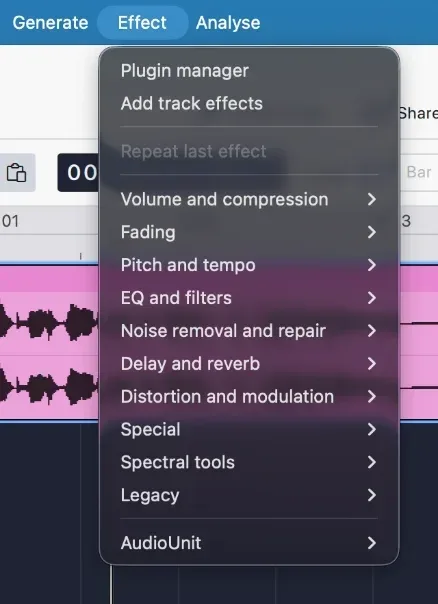

import Callout from "../../../components/manual/Callout.astro";
import Shortcut from "../../../components/manual/Shortcut.jsx";
import UIShot from "../../../components/manual/UIShot.astro";

Before you apply anything, it helps to know that Audacity can apply an effect
in two different ways, and the difference matters once you want to change your
mind.

## Two ways to apply an effect

|                     | How it works                                                                                                                                                                                                                                                                                                                                                                              |
| ------------------- | ----------------------------------------------------------------------------------------------------------------------------------------------------------------------------------------------------------------------------------------------------------------------------------------------------------------------------------------------------------------------------------------- |
| **Destructive**     | Applied from the **Effect** menu to a selection. Audacity rewrites the audio itself, and you can see the waveform change. Undo will step back out of it while the project is open, but once you close the project the change is part of your audio for good.                                                                                                                              |
| **Non-destructive** | Added as a **realtime effect** on a track, or drawn as clip gain. Your recording is left alone and the effect is calculated on playback, so you can adjust it, switch it off, or remove it at any point, even weeks later. A realtime effect always applies to the whole track — for a shorter stretch, split it into its own clip and track, or use a destructive effect on a selection. |

## Destructive effects

Every destructive effect lives in the **Effect** menu, grouped by what it
does. Select the audio first, then pick an effect: it acts on the selection
only, and the waveform redraws when it finishes.

## Realtime effects

The **Effects** button on the track header opens the realtime effects panel.
The keyboard shortcut is <Shortcut client:load keys="e" />.

<UIShot
  name="app/SceneSpotlightEffects"
  alt="The cursor on the Effects button in the track header"
/>

The panel opens on the left, showing the focused track's effects: focus a
different track and the panel follows. Click **Add effect** to pick from the
list, and effects run in the order they are stacked, top to bottom.

<UIShot
  name="app/SceneEffectsPanel"
  alt="The realtime effects panel open, with Compressor and Reverb stacked on the track"
/>

When you add an effect it joins the stack and its own window opens, ready to
adjust.

<UIShot
  name="app/SceneEffectsPanel"
  state="compressor"
  alt="The Compressor's window open over the project, its settings ready to adjust, with the effect in the panel's stack"
/>

- **Change its settings** by clicking the effect's name. Effect windows often
  have their own look, nothing like Audacity — that is normal, and the main
  window stays usable while one is open.
- **Bypass** an effect with the power button beside it, or the whole stack
  with the power button at the top — the quickest way to hear before-and-after.
- **Remove** an effect for good with the triangle beside its name, choosing
  **No effect**.

<Callout type="tip" title="Start with realtime effects">
  Realtime effects are the easier place to experiment, since you can hear a
  change and undo your thinking without touching the recording. Use the Effect
  menu when you know what you want.
</Callout>

## Master effects

At the bottom of the same panel is a **Master effects** section. Effects here
apply to the finished mix — after every track, each track's own effects, and
the volume and pan controls have been combined — rather than to any one
track. This stage of shaping the combined sound is what "mastering" means.

<Callout type="tip" title="Two classic master effects">
  A little reverb on the master stops a music project sounding dry, and a
  limiter on the master catches peaks before they clip. Working on the loudness
  and polish of the whole mix here is easier than chasing it track by track.
</Callout>

## Nothing to render

You do not need to "apply" any of this: realtime and master effects are baked
in automatically when you [export your audio](/manual/getting-started/export-your-audio).
If you ever do want a track's stack written into its waveform, select the
track and use **Tracks → Mix → Mix and Render** — with more than one track
selected it mixes them together, so select carefully.

## Getting more effects

Audacity ships with a starter set, and takes plugins in the **VST3**, **VST**,
**LV2**, **LADSPA** and (on macOS) **Audio Units** formats. MuseHub carries a
curated collection, and more are gathered at
[plugins.audacityteam.org](https://plugins.audacityteam.org/). Installed
plugins appear after you restart Audacity.

When the sound is where you want it, it is time to
[save your project](/manual/getting-started/save-your-project).
