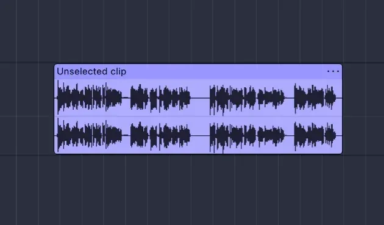
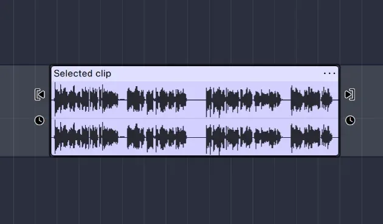
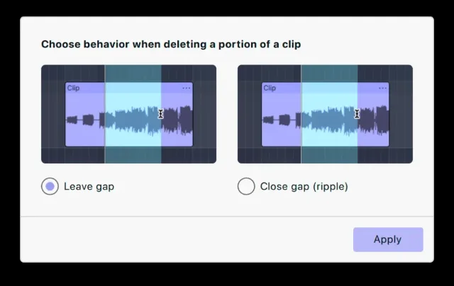
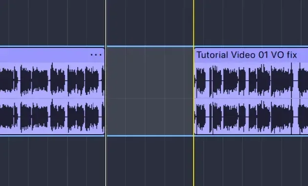
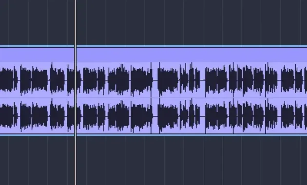
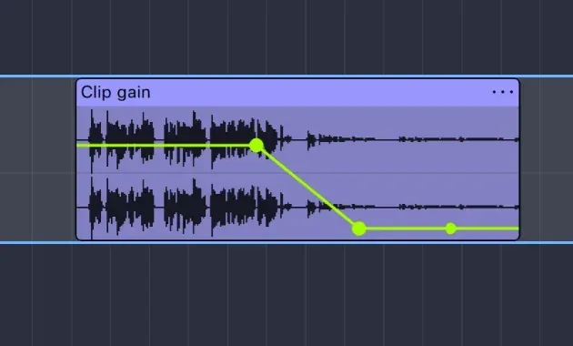

import Callout from "../../../components/manual/Callout.astro";
import Shortcut from "../../../components/manual/Shortcut.jsx";

Almost every edit in Audacity is the same two moves: choose the audio you want
to change, then run a command on it. Learn that loop and the rest of the
editing commands are variations on it. This page works on a single track and
takes you from a raw take to a tidier one, with nothing you do along the way
being permanent.

## Before you start

You need a track with some audio in it. If you have not got one yet,
[make your first recording](/manual/getting-started/make-your-first-recording),
or drag an audio file onto the Audacity window to import it.

## Clips: the thing you are editing

Everything you recorded lives inside a **clip**: a block of audio sitting on a
track. Recording and importing both create clips. Nearly all spoken-word
editing is clip work: trim the ends, split out a mistake, slide what's left
together.

Click a clip to select it. Anything you do next — trimming, splitting,
deleting or applying an effect — applies to what is selected. A selected clip
also shows two pairs of handles at its edges: the top pair trim the clip, and
the lower pair, marked with a clock icon, change its speed.

## Select the audio you want to change

Selection also works in stretches smaller than a clip. Click in the waveform
and drag left or right. The selected stretch is highlighted across the track,
and dragging downwards as well selects the same stretch on every track you
pass over.

- Hold **Shift** and click to extend the selection you already have out to the
  point you clicked.
- Double-click a clip to select the whole of it; double-click an empty part of
  a track to select all of that track's audio.
- **Select → Select all**, or <Shortcut client:load keys="cmd+a" />, selects
  everything in the project.

Press **Play** before you edit. Playback follows the selection, so you hear
exactly the stretch you are about to change — the quickest way to catch a
selection that starts a syllable too early.

## Trim, split and move

These three moves, on their own, cover most of a spoken-word edit.

- **Trim** by dragging a clip's left or right edge inwards. Nothing is
  destroyed; drag back out to recover it.
- **Split** a clip in two, then delete the half you don't want. There are
  three ways to do it: switch on the **split tool** in the toolbar with
  <Shortcut client:load keys="s" />, click where you want the cut, and press
  <Shortcut client:load keys="s" /> again to switch it back off; place the
  cursor where you want the cut and press <Shortcut client:load keys="cmd+i" />;
  or select a time range and press <Shortcut client:load keys="cmd+i" /> to
  cut at both edges of the selection, giving you a clip you can delete on its
  own.
- **Move** a clip by dragging it **by its header**, the strip along the top of
  the clip, either along its track or onto another track. Dragging inside the
  body of the clip does something different: it makes a time range selection.

## Cut, copy and paste

With a selection made, the clipboard commands work the way they do everywhere
else. All three are in the Edit menu.

- [Cut](/manual/manual-index/header/edit#cut),
  <Shortcut client:load keys="cmd+x" />, removes the selection and puts it on
  the clipboard.
- [Copy](/manual/manual-index/header/edit#copy),
  <Shortcut client:load keys="cmd+c" />, takes a copy and leaves the audio
  alone.
- [Paste](/manual/manual-index/header/edit#paste),
  <Shortcut client:load keys="cmd+v" />, drops the clipboard in at the cursor.

## Remove, keep or mute a stretch

Three commands cover most tidying up, and the difference between them is what
happens to the timing of everything that follows.

- [Delete](/manual/manual-index/header/edit#delete) removes the selection or
  the selected clip. The first time you delete anything, Audacity asks how
  deletion should behave, and remembers your answer — see below.
- [Trim clip](/manual/manual-index/header/edit#trim-clip),
  <Shortcut client:load keys="cmd+t" />, is the opposite of Delete: it keeps the
  selection and discards the rest of the clip. Use it to strip the silence off
  both ends of a take in one move.
- [Silence audio](/manual/manual-index/header/edit#silence-audio),
  <Shortcut client:load keys="cmd+l" />, empties the selection without
  shortening it. This is what you want for a cough or a page turn in the middle
  of a sentence, where removing the time would ruin the rhythm.

## Deleting audio: leave a gap, or ripple

The first time you delete anything, a flyout appears asking which of two
behaviours you want. Both are useful, and you can change your mind afterwards.

**Leave a gap** replaces the deleted audio with silence, and everything else
stays exactly where it was. Timing across tracks is preserved, which matters
when a music bed or a second voice has to stay in sync.

**Close gap (ripple)** closes the gap and everything after it slides back, so
the recording gets shorter. This is what you usually want when cutting a
stumble out of a single voice track.

Whichever behaviour you pick in the flyout becomes what the Delete key does,
but you are not stuck with it. The alternatives stay on the keyboard:
<Shortcut client:load keys="shift+del" /> ripple-deletes on the track you are
working in, whatever your default, and <Shortcut client:load keys="cmd+del" />
ripple-deletes across every track at once, keeping them in sync.

## Fades and volume: the clip gain tool

Fades and volume changes inside a clip are drawn rather than applied as an
effect. Switch on the **clip gain tool** in the toolbar and you can add points
along the clip and drag them to build a curve: down to nothing for a fade out,
up from nothing for a fade in, or a dip under a line of speech to duck
background music.

Click on the line to add a point, then drag it. Two points near the end of a
clip pulled down to nothing gives you a clean fade out. Watch the waveform as
you drag: it shrinks to match the curve, so you can see the audio getting
quieter rather than having to take it on trust. Switch the tool back off when
you are done, so ordinary clicks select clips again.

<Callout type="tip" title="A second is plenty">
  Long fades on speech sound like a mistake. Keep them short at the top and
  tail, and save the longer ones for music. And leave the breaths in — cutting
  every pause makes speech sound unnatural and rushed. Remove stumbles and
  long gaps, not the rhythm of talking.
</Callout>

## Snapping

**Snapping** keeps your edits tidy. Tick the **Snap** checkbox in the toolbar
and choose an interval, seconds being the easiest to work with. Everything
then lands on that grid: moving clips, trimming, and making a time selection.

<Callout type="warning" title="When everything keeps jumping">
  It is easy to leave snapping on and forget about it. If you later find you
  cannot select or trim to the exact spot you want, because everything keeps
  jumping to the nearest interval, that is why. Untick Snap and it goes back
  to fine control.
</Callout>

## Undo anything

Press <Shortcut client:load keys="cmd+z" /> for
[Undo](/manual/manual-index/header/edit#undo). It steps back through your edits
one at a time, and it keeps going — Audacity remembers the whole session, not
just the last change. [Redo](/manual/manual-index/header/edit#redo),
<Shortcut client:load keys="cmd+shift+z" />, steps forward again if you went
too far.

That is what makes the rest of this safe to explore. Try a command, listen, and
undo it if it was wrong.

Next, move up from stretches of audio to whole clips in
[cut, move, and arrange clips](/manual/getting-started/cut-move-and-arrange-clips).
