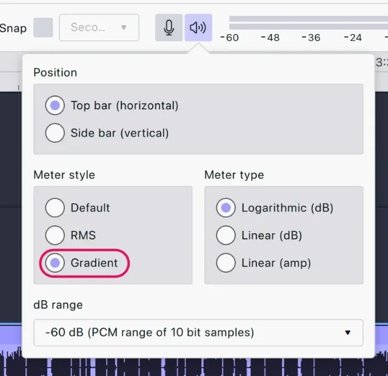

import Callout from "../../../components/manual/Callout.astro";
import Shortcut from "../../../components/manual/Shortcut.jsx";
import UIShot from "../../../components/manual/UIShot.astro";

The **input** is what Audacity listens to: your microphone. The **output** is
what it plays through: your headphones. Both are set in **Audio setup**, in
the middle of the top bar. By default Audacity uses whatever your computer
has set as its default microphone and speaker — which is often not the ones
you want — so it is worth checking before you record.

## What you need

- **A microphone.** USB straight into the computer, or an XLR microphone
  through an audio interface.
- **Headphones.** More important than the microphone: they stop playback
  bleeding back into the recording.
- **A quiet room.** Soft furnishings, curtains and carpet do more for your
  sound than any effect. Turn off fans and close windows.

## Plug it in

How your microphone connects depends on what it is:

- **A USB microphone** goes straight into a USB port.
- **A microphone with a 3.5 mm jack** goes into the microphone input, not
  the headphone output. Many laptops have a single combined socket for a
  headset, and a microphone-only plug may need an adapter to work in it.
- **An XLR microphone** goes into an audio interface, and the interface into
  a USB port. An XLR microphone cannot connect to a computer on its own.

Sockets vary by model, so check your computer's and your microphone's own
documentation if you are unsure — and expect to need an adapter if the plug
and the port do not match.

<Callout title="No microphone yet?">
  Most laptops have one built in, and it is good enough to work through these
  pages and hear how Audacity behaves. It will sound noticeably worse than even
  an inexpensive external microphone — thinner, more distant, and full of the
  room — so treat it as a way to get started rather than a way to record
  something you intend to publish.
</Callout>

## Choose your devices

<UIShot
  name="app/SceneAudioSetupMenu"
  alt="The Audio setup menu open, listing Host, Playback device, Recording device, Recording channels, Rescan audio devices and Audio settings"
/>

1. Connect your microphone or interface **first, then open Audacity**.
   Devices connected afterwards may not be listed straight away — if one is
   missing, use **Rescan audio devices** at the bottom of the Audio setup
   menu rather than restarting the application.
2. Open **Audio setup** and pick your microphone under **Recording device**.
   Pick it by the name of the microphone or interface.
3. Pick your headphones under **Playback device**. If you hear nothing on
   playback later, this is the first thing to check.

<UIShot
  name="app/SceneAudioSetupPlaybackdevice"
  alt="The Playback device submenu expanded, listing the system default and the available outputs"
/>

<UIShot
  name="app/SceneAudioSetupRecordingdevice"
  alt="The Recording device submenu expanded, with USB Microphone selected"
>
  The device names shown are examples — yours will be whatever is connected to
  your computer.
</UIShot>

<Callout title="Not everything in the list is a microphone">
  The menu offers every input the system knows about, which usually means
  webcams, and virtual devices created by other software, sitting alongside the
  real ones. Choose the entry named after your microphone or interface. If two
  look plausible, record a few seconds with each — the right one is the one you
  can hear.
</Callout>

## Set your level

The microphone button in the toolbar opens the **Record level** flyout. This
is where you check your level and set the recording volume without having to
record anything.

<UIShot
  name="flyouts/RecordLevelPopup"
  state="open"
  alt="The Record level flyout: a microphone level slider marked from −60 to 0 dB, with input monitoring and mic metering checkboxes"
/>

1. Speak at the volume you will actually use, and watch the input meter
   move.
2. Adjust the level so your normal speech peaks between **−18 dB and
   −6 dB**. Leave headroom: audio that touches 0 dB is clipped, and clipping
   cannot be repaired afterwards.
3. This slider controls your system's input level, so the change applies to
   every other application on your computer as well.

If the meter barely moves while you speak normally, the level is too low.
Raise it here, or move closer to the microphone. A recording made too quietly
can be lifted afterwards with the **Amplify** effect, but that lifts the room
noise with it — so it is always worth getting the level right now.

<Callout type="tip" title="Read the meter at a glance">
  In the playback meter's settings, choose the Gradient style. It colours the
  bar as it rises — green is comfortable, amber is loud but usable, red means
  clipping. If you are hitting red, turn the gain down at the microphone or
  interface rather than trying to fix it afterwards.
</Callout>

## Hearing yourself

**Input monitoring**, switched on from the same flyout, plays your
microphone back through your output so you can hear yourself as you speak.

<Callout type="warning" title="Headphones on before you switch monitoring on">
  Monitoring through speakers sends your microphone straight back out into the
  room, and the microphone picks that up again. The result is a feedback howl
  that gets louder the longer it runs — loud enough to damage hearing and
  equipment. Headphones on first, volume low, then switch monitoring on.
</Callout>

## Mono or stereo?

One microphone produces one channel, so a voice is **mono** — recording it
in stereo just gives you two identical copies and a file twice the size. A
USB microphone is one channel; an XLR microphone through an interface is
still mono for a single voice, and if the interface has two inputs, each
microphone wants its own mono track rather than two people sharing a stereo
one. Save stereo for music, and for anything you were given as a stereo file
already.

Set the channel count under **Recording channels** in Audio setup.
