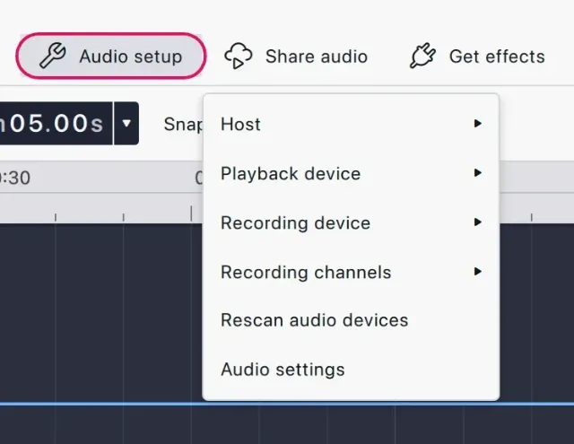
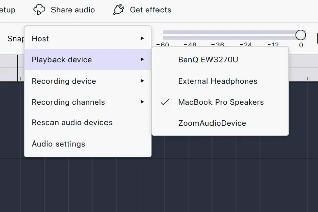
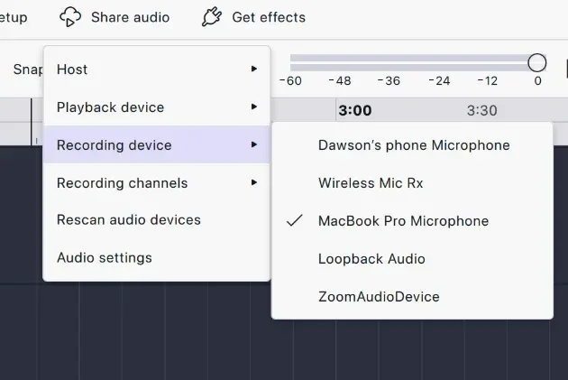
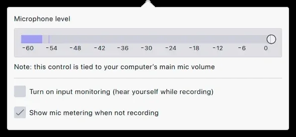

import Callout from "../../../components/manual/Callout.astro";
import Shortcut from "../../../components/manual/Shortcut.jsx";

The **input** is what Audacity listens to: your microphone. The **output** is
what it plays through: your headphones. Both are set in **Audio setup**, in
the middle of the top bar. By default Audacity uses whatever your computer
has set as its default microphone and speaker — which is often not the ones
you want — so it is worth checking before you record.

## What you need

- **A microphone.** USB straight into the computer, or an XLR microphone
  through an audio interface.
- **Headphones.** More important than the microphone: they stop playback
  bleeding back into the recording.
- **A quiet room.** Soft furnishings, curtains and carpet do more for your
  sound than any effect. Turn off fans and close windows.

## Choose your devices

1. Connect your microphone or interface **first, then open Audacity**.
   Devices connected afterwards may not be listed straight away — if one is
   missing, use **Rescan audio devices** at the bottom of the Audio setup
   menu rather than restarting the application.
2. Open **Audio setup** and pick your microphone under **Recording device**.
   Pick it by the name of the microphone or interface.
3. Pick your headphones under **Playback device**. If you hear nothing on
   playback later, this is the first thing to check.

## Set your level

The microphone button in the toolbar opens the **Record level** flyout. This
is where you check your level and set the recording volume without having to
record anything.

1. Speak at the volume you will actually use, and watch the input meter
   move.
2. Adjust the level so your normal speech peaks between **−18 dB and
   −6 dB**. Leave headroom: audio that touches 0 dB is clipped, and clipping
   cannot be repaired afterwards.
3. This slider controls your system's input level, so the change applies to
   every other application on your computer as well.

<Callout type="tip" title="Read the meter at a glance">
  In the playback meter's settings, choose the Gradient style. It colours
  the bar as it rises — green is comfortable, amber is loud but usable, red
  means clipping. If you are hitting red, turn the gain down at the
  microphone or interface rather than trying to fix it afterwards.
</Callout>

## Hearing yourself

**Input monitoring**, switched on from the same flyout, plays your
microphone back through your output so you can hear yourself as you speak.

<Callout type="warning" title="Headphones on before you switch monitoring on">
  Monitoring through speakers sends your microphone straight back out into
  the room, and the microphone picks that up again. The result is a feedback
  howl that gets louder the longer it runs — loud enough to damage hearing
  and equipment. Headphones on first, volume low, then switch monitoring on.
</Callout>

## Mono or stereo?

One microphone produces one channel, so a voice is **mono** — recording it
in stereo just gives you two identical copies and a file twice the size. A
USB microphone is one channel; an XLR microphone through an interface is
still mono for a single voice, and if the interface has two inputs, each
microphone wants its own mono track rather than two people sharing a stereo
one. Save stereo for music, and for anything you were given as a stereo file
already.

Set the channel count under **Recording channels** in Audio setup.
