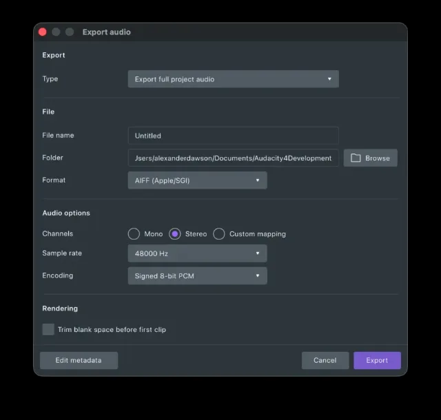

import Callout from "../../../components/manual/Callout.astro";
import Shortcut from "../../../components/manual/Shortcut.jsx";

Exporting produces a finished audio file with everything mixed together: the
thing you upload to a podcast host or send to someone else. It is the other
half of [saving your project](/manual/getting-started/save-your-project) — the
`.aup4` project keeps your edits editable, and the export is the result. Doing
one does not do the other, so save the project even after you have exported.

## Exporting for a podcast host

Podcast platforms do not take Audacity projects. Whether you are uploading to
Captivate, Spotify, Apple Podcasts, Buzzsprout, Acast or anywhere else, what
they want is a single finished audio file, and MP3 is the format every one of
them accepts. Exporting is how you produce it.

## Export a file

Open **File → Export audio**, or press

<Shortcut client:load keys="cmd+shift+e" />.

Name the file, choose where it goes, and pick a format. The dialog also lets
you choose mono or stereo, the sample rate, and — for formats like MP3 — the
bit rate.

<Callout type="info">
  Some export formats, including M4A, need [FFmpeg
  installed](/manual/basics/installing-ffmpeg) before they appear.
</Callout>

<Callout type="info" title="A prompt about folder access">
  The first time you export into a folder like Documents, your computer may ask
  whether Audacity is allowed to access it. Allow it, or the export cannot be
  written there.
</Callout>

## Which settings?

Your host may have its own guidance on file size, bit rate or loudness, and if
it does, follow that instead. If nobody has told you otherwise, MP3 at
128 kbps is a safe default for spoken word: small enough to upload and stream
comfortably, and transparent enough for a voice.

Beyond that default, three tips go a long way:

- **A single voice wants mono.** Stereo doubles the file for two identical
  channels — save it for music and anything recorded in stereo.
- **Opus and M4A beat MP3** at the same file size, if your destination
  accepts them.
- **FLAC and WavPack shrink WAV by up to half without losing anything** —
  the archival choice when quality matters and MP3 will not do.
