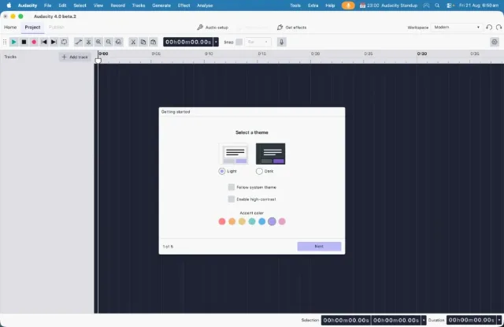

import Callout from "../../../components/manual/Callout.astro";
import Shortcut from "../../../components/manual/Shortcut.jsx";
import BestPractices from "../../../components/manual/BestPractices.astro";
import Pitfalls from "../../../components/manual/Pitfalls.astro";
import ManualDownloadButton from "../../../components/manual/ManualDownloadButton.jsx";
import Tabs from "../../../components/manual/Tabs/Tabs.astro";
import Tab from "../../../components/manual/Tabs/Tab.astro";

{/*
PLACEHOLDER CONTENT — written to exercise the page design, not verified
against the application. Every version number, menu name and dialog label
below needs checking before this ships.
*/}

Audacity is free, open source, and runs on Windows, macOS and Linux. This page
takes you from a fresh download to an application you can open. It should take
about five minutes, most of which is the download itself.

## Before you start

You need around 500 MB of free disk space and, for the installer, an account
with permission to install software on the machine. If you're on a managed
work computer you may need whoever administers it to approve the install.

<Callout type="info">
  Audacity does not require an account, a licence key, or an internet connection
  after it's installed.
</Callout>

## Download the installer

<ManualDownloadButton client:load />

It downloads the build for your platform. Every build for every operating
system is on the [download page](/download) if you need a different one.

<Tabs>
  <Tab label="Windows">

Download the `.exe` installer. Both 64-bit and 32-bit builds are listed —
choose 64-bit unless you know the machine is 32-bit.

Once it's downloaded, double-click the file and follow the prompts. You can
accept every default; the installer will suggest a location and create a
Start menu entry.

  </Tab>
  <Tab label="macOS">

Download the `.dmg` disk image, then open it and drag the Audacity icon into
your Applications folder.

The first time you open it, macOS may warn that the application was
downloaded from the internet. Choose **Open** to confirm.

  </Tab>
  <Tab label="Linux">

Audacity is available as an AppImage, and through most distribution package
managers.

The AppImage needs no installation — make it executable and run it. Package
manager versions may lag behind the current release.

  </Tab>
</Tabs>

## Open Audacity for the first time

Launch Audacity the way you'd launch anything else on your system. Onboarding
runs once, the first time you open the application: it asks a few questions
about how you intend to work — your theme, clip colours, and which workspace
layout you'd like to start with — and sets sensible defaults from your
answers.

None of those choices are permanent. You can change all of them later from
**Preferences**.

<Callout type="tip" title="Skip the setup">
  If you'd rather get straight to recording, accept the defaults. The **Modern**
  workspace and the dark theme are what most of this guide's screenshots use.
</Callout>

## Check it's working

With Audacity open, press <Shortcut client:load keys="cmd+n" /> to create a
new empty project. You should get a window with a toolbar across the top and
an empty track area below it.

If you get that far, the install worked and you're ready to
[connect your microphone](/manual/getting-started/connect-your-microphone).

<BestPractices>
  Download from audacityteam.org rather than a third-party mirror — builds
  hosted elsewhere are sometimes bundled with software you didn't ask for. Keep
  the installer file until you've confirmed Audacity opens, in case you need to
  run it again.
</BestPractices>

<Pitfalls>
  Installing over a much older version can carry settings forward that no longer
  apply. If Audacity behaves oddly after an upgrade, resetting preferences is
  usually the fastest fix. On managed machines, an install that appears to
  succeed but leaves no application behind has usually been blocked by policy.
</Pitfalls>
