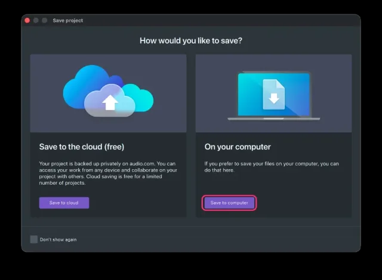
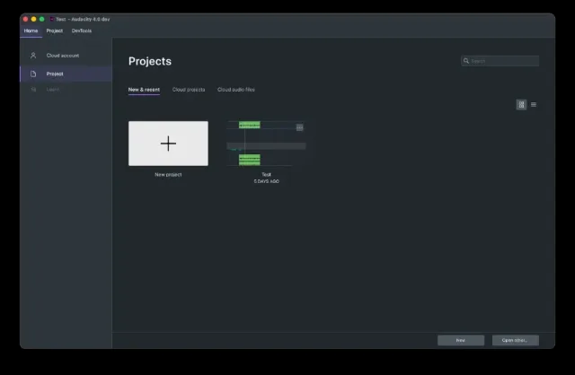

import Callout from "../../../components/manual/Callout.astro";
import Shortcut from "../../../components/manual/Shortcut.jsx";

Saving and exporting are the single most common source of confusion for new
users, so it is worth being precise.

| Action           | What you get                                                                                                                                                                                                 |
| ---------------- | ------------------------------------------------------------------------------------------------------------------------------------------------------------------------------------------------------------ |
| **Save project** | An `.aup4` file holding your tracks, clips, edits and undo history. Only Audacity can open it. This is your working file — reopen it and you can still untrim clips or adjust realtime effects, weeks later. |
| **Export audio** | A finished audio file, everything mixed together. This is what you upload to your podcast host or send to someone else.                                                                                      |

Save the project as soon as you start recording — <Shortcut client:load keys="cmd+s" />
— and keep saving as you go. Export only when the edit is finished. If you
export without saving the project, you cannot go back and change your edits.

<Callout type="info" title="Coming from Audacity 3?">
  Audacity 4 saves projects as `.aup4`. It still opens the `.aup3` projects you
  made in Audacity 3, so your old work comes with you.
</Callout>

## The first time you save

A window appears asking whether you want to save to the cloud or to your own
computer.

Your own computer is the simpler place to start: a project on your own drive
is easy to find, back up and reason about. Cloud saving comes into its own
once you are collaborating or moving between machines, and you can switch to
it whenever that day arrives.

<Callout type="warning" title="Save to your computer's own drive">
  Avoid keeping an active project on an external drive, a USB stick or network
  storage. Audacity needs fast, uninterrupted access to the project while you
  record and edit, and those can all stall at the wrong moment.
</Callout>

## Saving to the cloud

When you do want a cloud project, choose **File → Save to Cloud** and click
**Link Account** — you will be walked through creating an
[audio.com](https://audio.com/) account and connecting it to Audacity. After
that, saving to the cloud is just a project name and **Save**; the upload
happens in the background while you keep working. Cloud projects are backed
up and versioned, so a failing computer does not take your work with it, and
they are easy to share with collaborators.

The first cloud save also asks how often to generate a **mixdown** — a
listenable preview of your project for audio.com. If you are not
collaborating, you can skip mixdowns entirely, and the choice can be changed
any time under **Edit → Preferences → Cloud**.

## Finding your projects again

Saved projects appear on the **Home** tab, so you can reopen one without going
looking for the file.

When the edit is finished, the other half of the story is to
[export your audio](/manual/getting-started/export-your-audio).
