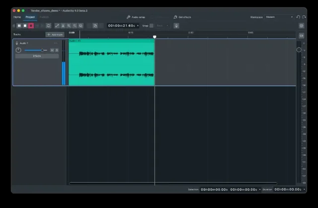

import Shortcut from "../../../components/manual/Shortcut.jsx";

By the end of this page you will have a finished episode: recorded in
Audacity, edited down, cleaned up, set to music and exported as a file your
podcast host will accept. Each phase below is the short version, with a link
to the page that covers it properly — read straight through the first time,
then come back to whichever phase you are on.

## 1. Get set up

You need a microphone (USB straight into the computer, or XLR through an
audio interface), headphones, and a quiet room — soft furnishings do more
for your sound than any effect. Open **Audio setup**, pick your microphone
as the recording device and your headphones as the playback device, then
adjust the record level so your normal speech peaks between **−18 dB and
−6 dB** — audio that touches 0 dB is clipped and cannot be repaired. Put
your headphones on _before_ switching on input monitoring, or the microphone
feeds back through the speakers in a howl loud enough to damage hearing and
equipment.

Full walkthrough: [Connect your microphone](/manual/getting-started/connect-your-microphone).

## 2. Record your takes

Press <Shortcut client:load keys="r" /> to record and a track appears on its
own. Start every session with a few seconds of silence: it gives you room to
trim, and it is the sample of your room's background noise that noise
reduction will learn from later. When you fluff a line, do not stop — pause,
leave a beat of silence, and say it again; cutting the bad take out later is
far quicker than starting over. Give each voice its own track, so you can
balance and clean them separately.

Full walkthrough: [Make your first recording](/manual/getting-started/make-your-first-recording).

## 3. Edit the episode

Everything you recorded lives in clips, and nearly all podcast editing is
clip work: trim the ends by dragging a clip's edges, split at the playhead
with <Shortcut client:load keys="cmd+i" /> or the split tool
(<Shortcut client:load keys="s" />), and ripple-delete the stumbles so the
gap closes behind them. Remove the mistakes and the long dead patches, but
leave the breaths in — cutting every pause makes speech sound unnatural and
rushed. Try things freely: <Shortcut client:load keys="cmd+z" /> steps back
through everything you have done since opening the project.

Full walkthroughs: [Basic audio editing](/manual/getting-started/basic-audio-editing)
and [Editing a recording](/manual/how-to/editing-audio).

## 4. Clean up the voice

The order matters more than the settings: **high-pass filter → noise
reduction → compression → EQ → normalise or limit**, because each step is
easier when the one before it has already tidied up. You do not need all
five — high-pass, compression and normalise will carry most recordings. As
starting points for a single spoken voice: compressor threshold **−18 dB**
at a ratio of **3:1**, and normalise the finished edit to **−1 dB**, run
last. Set them, listen, and adjust by ear.

Full walkthroughs: [Removing background noise](/manual/how-to/noise-reduction)
and [Removing clicks and pops](/manual/how-to/click-and-pop-removal).

## 5. Add music

Drag a music file into the project and it lands on its own track; slide it
along the timeline to place your intro. Then duck it under the speech with
the clip gain tool — draw the music's level down while someone is talking,
far enough that you stop noticing it. Check the licence before you publish:
look for Creative Commons or royalty-free libraries, and keep a note of any
attribution the licence requires so you can put it in your show notes.

Full walkthrough: [Mixing voice with background music](/manual/how-to/mixing-voice-with-music).

## 6. Export and publish

Save the project (<Shortcut client:load keys="cmd+s" />) as soon as you
start recording and keep saving as you go — the `.aup4` project is your
working file, holding tracks, clips and edits, and only Audacity can open
it. What you upload is an export: press

<Shortcut client:load keys="cmd+shift+e" /> and choose **MP3** at **128 kbps**,
**mono** for a single voice. If your host publishes its own guidance on format
or loudness, follow that instead. Fill in the metadata — title, artist and
episode number travel with the file and show up in players.

Full walkthrough: [Export your audio](/manual/getting-started/export-your-audio).

## Common mistakes

- **Recording the whole episode before checking levels.** Always test for
  ten seconds and play it back.
- **Normalising before compressing**, which brings the noise up with the
  voice.
- **Over-applying noise reduction** until voices sound thin and watery.
- **Monitoring on speakers**, so the playback bleeds into the microphone.
