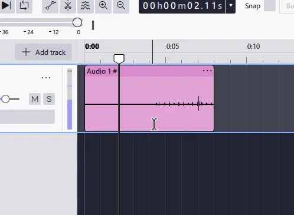

import Shortcut from "../../../components/manual/Shortcut.jsx";

## Adjusting settings before you record

#### Latency correction:

It is a _pre-requesite_ that you tune the [Latency correction](https://support.audacityteam.org/troubleshooting/solving-recording-problems/latency-compensation) setting for your audio interface so that play-back and recording are synchronized.

Failure to do this may result in unwanted bursts of audio at the splice point, especially if you are not using headphones.

#### Pre-roll and Crossfade

You may wish to adjust the pre-roll duration and crossfade duration in [Recording Preferences](https://manual.audacityteam.org/man/recording_preferences.html) to suit your personal preferences:

1. Pre-roll is the amount of existing audio, in seconds, that will be played before the repair recording starts. The default is five seconds.
2. Crossfade is the length of crossfade, in milliseconds, that Audacity will apply at the splice point to smooth the transition. The default is ten milliseconds.

### Record as usual, until you make a mistake

Begin recording as usual with the [Transport toolbar](https://manual.audacityteam.org/man/transport_toolbar.html) Record button, the menu command Transport > Recording > Record, or the keyboard shortcut <Shortcut client:load keys="R" /> key.

If you make a mistake, stop recording with the [Transport toolbar](https://manual.audacityteam.org/man/transport_toolbar.html) Stop button or its shortcut <Shortcut client:load keys="Spacebar" />.

### Choose a splicing point

Select a position in the recording before the error by picking in the recording track. You must select a time within the recorded clip.

You may wish to use a selection and play it, extending or shrinking it to find an appropriate splicing point. If you select a time range, only the left edge is used as the splicing point - and please be aware that using Lead-In will then discard the selection as well as all audio following it.

### Using Lead-In Record

The command Recording > Lead-In Record can be used to start Lead-In recording, but it is more easily done with the keyboard shortcut Shift + D. You can, if you wish, reassign this shortcut to another key or key combination of your choosing using [Shortcut Preferences](https://manual.audacityteam.org/man/keyboard_preferences.html), located in Edit -> Preferences -> Shortcuts

The Lead-In edit will:

- Delete the portion of the selected track after the splicing point. _And note that this will include the selection if you have one_
- Play the pre-roll audio _(length as defined by your Pre-roll setting in&#x20;_[_Recording Preferences_](https://manual.audacityteam.org/man/recording_preferences.html)_, default is five seconds)_.
- When the play head reaches the splice point _(now the end of the track)_ Audacity switches to record mode to enable you to make your correction and continue recording.
- The repair recording will roll until you stop it with the Stop button or <Shortcut client:load keys="Spacebar" />

  
