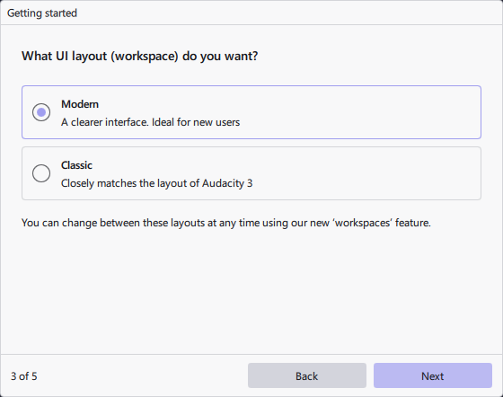
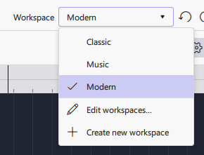
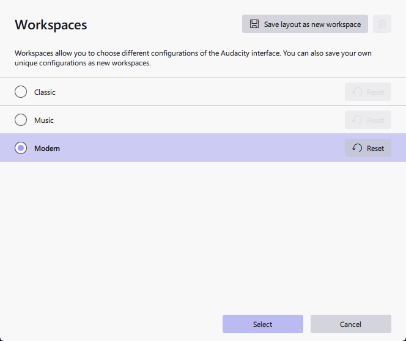

## Workspaces

&#x20;

## Selecting Workspaces

You can select the Workspace either during the onboarding of Audacity 4, which gives you 2 options that are best suited for either new Users or experienced Audacity 3 users.&#x20;

You can also select a workspace at any time by clicking on the Workspace dropdown menu, situated in the top right corner of Audacity 4 window UI.

There are 3 default workspaces that are pre-defined in Audacity 4.&#x20;

## Workspace Editor

You can also edit existing workspaces via 'Edit workspaces', which will open a new window.

This workspace editor allows you:

- Save the current layout as a new workspace, cloning the workspace currently being used
- Switch between the workspaces
- Delete non-default workspaces that you've created
